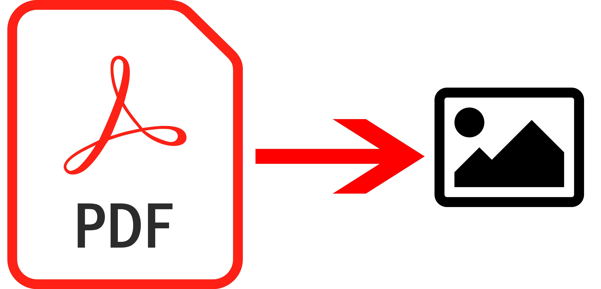

# PDF To Image API - Python

## Overview

Due to the pandemic we have found ourselves sharing PDF's more than ever. However still some people face problem understanding the PDF file or opening the same on a compatible app. In all most applications, a person can view a page in the app itself, without installing a different application all together.   

To enable the same, [@formula21](https://formula21.github.io) has bought you an API which accepts a PDF file only to convert it's page(s) to high quality image(s).

Built in Python and deployed through Flask Server, the integrated experience is tailored to any user(s) experience.

## App Documentation

> Coming Soon

## License
The project comes with an open-source MIT License. If you have not received the same with your copy of the project here the license is as below:

> Copyright 2022 Anweshan Roy Chowdhury

> Permission is hereby granted, free of charge, to any person obtaining a copy of this software and associated documentation files (the "Software"), to deal in the Software without restriction, including without limitation the rights to use, copy, modify, merge, publish, distribute, sublicense, and/or sell copies of the Software, and to permit persons to whom the Software is furnished to do so, subject to the following conditions:
> 
> The above copyright notice and this permission notice shall be included in all copies or substantial portions of the Software.
>
> THE SOFTWARE IS PROVIDED "AS IS", WITHOUT WARRANTY OF ANY KIND, EXPRESS OR IMPLIED, INCLUDING BUT NOT LIMITED TO THE WARRANTIES OF MERCHANTABILITY, FITNESS FOR A PARTICULAR PURPOSE AND NON INFRINGEMENT. IN NO EVENT SHALL THE AUTHORS OR COPYRIGHT HOLDERS BE LIABLE FOR ANY CLAIM, DAMAGES OR OTHER LIABILITY, WHETHER IN AN ACTION OF CONTRACT, TORT OR OTHERWISE, ARISING FROM, OUT OF OR IN CONNECTION WITH THE SOFTWARE OR THE USE OR OTHER DEALINGS IN THE SOFTWARE.